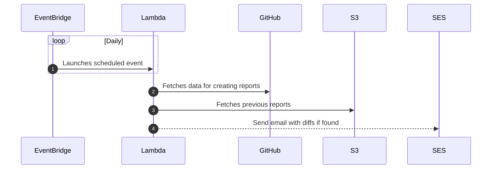

# GitHub Management Scripts

Keep track of your GitHub profile and organizations.</br>
Running on AWS, triggered by daily scheduled event.



## Environment Variables

The following environment variables are required for the app to run:

```shell
GITHUB_PAT="your-github-personal-access-token-goes-here"
S3_BUCKET_NAME="name-of-s3-bucket-goes-here"
ORGS_LIST="org-name,another-org-name"
EMAIL_RECIPIENT="email-to-send-notification-to-goes-here"
EMAIL_SENDER="email-to-send-mails-from-goes-here"
AWS_REGION="us-east-1"
```

## AWS Deployment

Instructions for deploying on AWS, the services used are:

- IAM
- Lambda
- S3
- SES
- CloudWatch
- EventBridge

### IAM

Goto `AWS IAM`:

- Create a service user and attach the `AWSLambda_FullAccess` permissions policy to it, take note of the new user's *access key id* and *secret access key*. We'll use this user's credentials to deploy `Lambda` function from the CI workflows.

- Create a `Role` and attach the following policies to it, `AWSLambdaExecute` which includes permission to `CloudWatch` and `S3`, and the `AmazonSESFullAccess` (full access is mandatory). We will use this for our `Lambda` execution for allowing our function to access the rest of services.

### S3

Goto `AWS S3`, create a bucket.

### SES

Goto `AWS SES` configure as you see fit, i.e. verify your custom domain and custom from domain if needed.</br>
Make sure to take you service out of the sandbox environment if you want to able to properly send emails.

### Lambda

Goto `AWS Lambda`:

- Create a function based on the execution `Role` you created earlier.
- Set the handler to `src/main.handler`.
- Set the timeout to 15 seconds.
- Upload a `Zip` archive containing at the root of it:
  - src/
  - node_modules/
- Publish a new version.
- Create two aliases named `Live` and `Dev` for pointing to their respective function uploads.
- Create the following environment variable for the function's context (*AWS_REGION* ic created by AWS):
  - GITHUB_PAT
  - S3_BUCKET_NAME
  - ORGS_LIST
  - EMAIL_RECIPIENT
  - EMAIL_SENDER

### CloudWatch

Goto to `AWS CloudWatch`, after the first function invocation, a designated log group will be created, the default retention for it will be *Never Expires*, you can reduce it, 1 week should suffice.

### EventBridge

Goto to `AWS EventBridge`, create a scheduled rule, for instance `0-10-*-*-?-*` will run daily at 10AM.</br>
Set it to invoke your recently created `Lambda` function, and select `Live` as the alias.</br>
Go back to `AWS Lambda`, and select the new `EventBridge` rule you created as th trigger.
